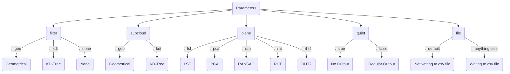
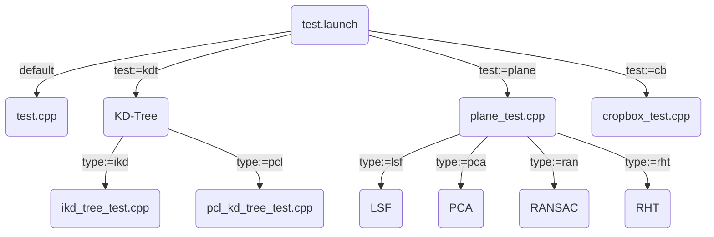

# Ground Finder

This ROS package is to find the normal vector of the ground plane from the current laser scan of the DAEDALUS spherical robot.
This package has been created as part of Caro's master thesis.

## Structure 
The ROS package includes the following folders.
- **data:** All Octave scripts used for evaluation, as well as the data collected for each experiemnt (structured within the subfolders named after plane segmentation algortihms). The GroundTruth folder within includes all necessary scripts and data collected for the establishment of the ground truth.
- **include and src:** Header and Source files of the ground finder node, as well as test scipts in a seperate folder within the src folder.
- **launch:** ROS launch files to start main node or test scripts.

## Installation
1. Make sure to have the following installed:
```bash
sudo apt-get install ros-noetic-pcl-conversions ros-noetic-pcl-ros libpcl-dev
```
2. Then download the ground_finder (and ikd_tree) folder and add to your src folder within your catkin workspace. If you do not download the ikd-tree make sure to remove it from `package.xml` and `CMakeLists.txt`.
3. Change the paths in `src/main.cpp` (lines 118 - 130) according to your catkin_ws location.
4. Call `catkin_make` and then launch the ground finder!

## Launch ground finder
Using roslaunch file: `main.launch`. Choose the wanted configurations with the parameters as follows.


## Test scripts
List of test scripts:
- Reading in point cloud from topic + test processing           (`src/test_files/test.cpp`)
- ikd-tree from hku mars (build + knn ranged search - runtime)  (`src/test_files/ikd_tree_test.cpp`)
- PCL kd-tree (build + knn search - runtime)                    (`src/test_files/pcl_kd_tree_test.cpp`)
- Ground plane detection (lsf/pca/ransac/rht) with n calculation(`src/test_files/plane_test.cpp`)

**HOW TO RUN TEST SCRIPTS:**
Using roslaunch file: `test.launch`. Choose the wanted test file with the parameters as follows.



Note: [Online mermaid editor](https://mermaid.live/edit#pako:eNpdj0FrwzAMhf-K0CmFZj_A0MGWrJddBsttHkXYyhzqOMa1GaXuf59KV-imi8R733ugE5rFMioc_fJtHKUMQw-gA8g8NZkP-cFTCcatbiK07WO1PFLxucLzlTExru79i6g2eytE17z27ZCYbw3dlThGVptpbyv0jaxdFmT3r-wejcZXeGmmN7cE_uMPTqIVth8jqZFaQwk6Sp-4xpnTTJOV_06XgMbseGaNSs7fFzTqcBaUSl7ej8GgyqnwGku0lLmf6CvRjNLrD3z-AfPCYKI)

## Authors
Carolin Bösch
